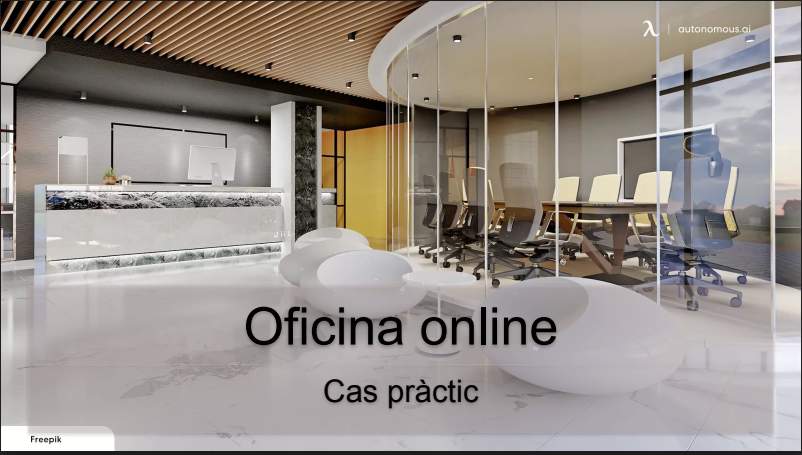

# Cas pràctic 1
 

INDEX

- 1-Perquè penseu que aquesta és una bona solució al nostre problema.	
- 2-El pressupost mensual i anual de la despesa del servei a contractar.	
- 3-Guia de creació de l’usuari administrador/a i usuari/a (Feu servir els comptes de correu de l’Institut).	
- 4-Guia de creació de les unitats compartides BACKUP i DOCUMENTS on es vegin els permisos assignats a cada tipus d’usuari/a.	
- 5-Guia d’instal·lació d’adreces directes als escriptoris dels dos tipus d’usuaris:	
- 6-Exemples d’ús de fer un backup per part de l’administrador/a.	
- 7-Exemples d’ús de consultar un document per part de l’usuari/a.	
- 8-Comproveu si un usuari/a pot eliminar sense voler algun document.	
